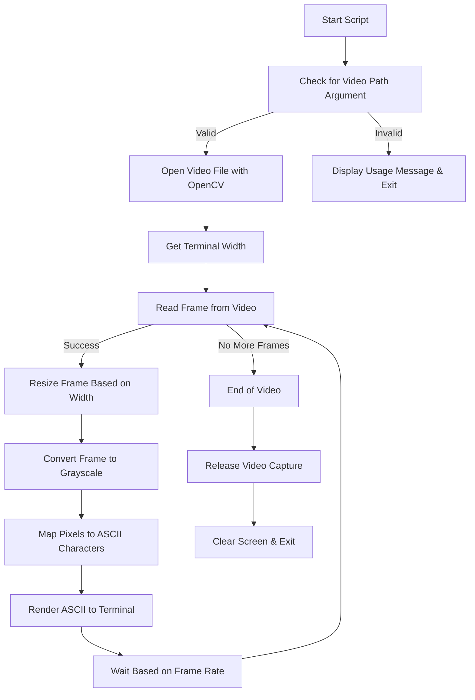

# 🎥 ASCII Video Player

- This Python script plays any video file as **ASCII art** directly in your terminal!  
- It reads video frames using OpenCV, converts them into grayscale ASCII representations, and animates them in real-time inside your terminal window.
- Created a ASCII video of the Aura Farming Kid from Indonesia.
---

## 📦 Features

- Converts video frames into ASCII art
- Dynamically resizes video to fit your terminal width
- Frame rate synced with the original video
- Supports graceful keyboard interrupt (`Ctrl+C`)
- Cross-platform support: works on Windows, Linux, and macOS

---

## 🛠️ Requirements

- Python 3.x  
- [OpenCV](https://pypi.org/project/opencv-python/) (`cv2`)

---

### Install Dependencies

```bash
pip install opencv-python
```
---
## 🚀 Usage
```bash
python ascii_video_player.py <path_to_video_file>
```
For best results, run in full-screen mode
---

## 🧠 Working Flow


